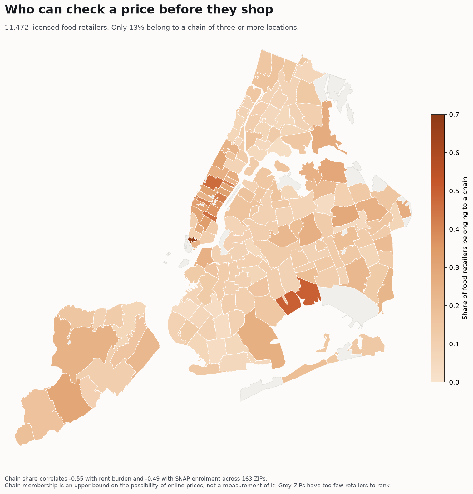

# Who can check a price before they shop

A companion analysis to The Basket. The Basket asks what groceries cost. This
asks a prior question: **can you find out at all, without physically walking
into the store?**

## What we found

New York City licenses **11,472 food retailers**. Only **13% belong to a chain of
three or more locations**. **83% carry a name used at exactly one address.**

That matters because a single-location store has no infrastructure to publish
prices. There is no shoppable catalog behind a bodega. So chain membership sets
an upper bound on who could possibly check a price online.

That upper bound is not evenly distributed. Across 163 ZIP codes:

| Chain share correlates with | |
|---|---|
| Share of households rent burdened | **&minus;0.55** |
| Share of households on SNAP | **&minus;0.49** |
| Median home value | **+0.37** |

All three point the same way. The neighbourhoods where people are most
cost-burdened are the neighbourhoods where prices are least knowable in advance.
Chain share runs from 3% to 69% by ZIP. The lowest are Sunset Park, Borough Park,
Hunts Point and Flushing. The highest are Tribeca, the Upper West Side and
Midtown East.

Comparison shopping is a middle-class affordance. If you can check three stores
from your couch, you can arbitrage them. If none of your stores publish anything,
your only option is to walk.

## Method

For every licensed food retailer in the five boroughs, the trading name is
normalised (case, punctuation, `#12` suffixes, `INC`/`LLC`) and counted. A name
appearing at **three or more** locations is treated as a chain. Chain share is
then aggregated by ZIP and joined to NYC DOHMH neighbourhood indicators.

ZIPs with fewer than 10 retailers are excluded as too noisy to rank.

**Robustness.** A correlation that survives only one arbitrary cut-off is not a
finding. Raising the floor from 10 to 20, 30 and 50 retailers moves the rent
burden correlation to &minus;0.57, &minus;0.62 and &minus;0.51 respectively. The
relationship is not an artifact of small ZIPs.

Rebuild with `python3 scripts/build_transparency.py`. No API key needed.

## What failed, and why it is in this document

The obvious version of this analysis is to visit every chain's website and record
whether it publishes prices. **That was attempted and abandoned, because
automated classification produced confidently wrong answers.** Three separate
failure modes:

**1. Anti-bot blocking.** Stop & Shop, BJ's, Trader Joe's and Gopuff returned
`403` to a scripted request. A classifier reading those responses concludes "no
prices published," which is false for at least two of them.

**2. Prices are not in the HTML.** Target, Wegmans and ShopRite all run
JavaScript applications. A product page fetched with `curl` contains no price at
all. Homepage signal detection classified Wegmans and ShopRite as "circular
only" and Target as "delivery only". All three are wrong.

**3. A dollar sign is not a price.** Loading Key Food in a real browser shows 45
dollar amounts, which looks like a catalogue. They are coupon discounts, `Save
$3.00`, and the site header reads `My Store: Select a Store`, meaning no
store-specific pricing had been loaded at all. A naive classifier counting
currency patterns would have scored Key Food as fully transparent.

The lesson generalises: **you cannot audit price transparency without a real
browser and a human check**, and any project claiming otherwise should be read
sceptically. Chain membership is used here precisely because it is a structural
fact that can be verified from a public registry, rather than a scraped
impression that cannot.

## What this does not show

- **Chain membership is an upper bound, not a measurement.** Belonging to a chain
  makes online prices possible, not actual. Several large chains publish only a
  weekly circular of sale items, which does not tell you the price of milk.
- **Independents are presumed to publish nothing, and that is a presumption.**
  Some NYC bodegas do appear on Instacart, DoorDash or Gopuff. This analysis does
  not measure how many, so the true transparency gap is somewhat narrower than
  the chain gap.
- **Delivery-platform prices are not shelf prices.** Where independents do appear
  online it is usually through a delivery platform, where prices are marked up.
  Visible is not the same as accurate.
- **The registry counts licences, not store size.** A 40,000 square foot
  supermarket and a corner deli each count as one retailer.
- **ZIP codes are a crude geography** and the correlations are ecological. They
  describe areas, not people.

## Sources

- NY State Department of Agriculture and Markets, Retail Food Stores registry,
  [data.ny.gov 9a8c-vfzj](https://data.ny.gov/d/9a8c-vfzj)
- NYC DOHMH ZCTA indicators, published with the 2019 food pricing survey,
  [nychealth/food-pricing-survey-nyc-2019](https://github.com/nychealth/food-pricing-survey-nyc-2019)
- ZIP Code Tabulation Areas, NYC Open Data `35j5-n34v`
